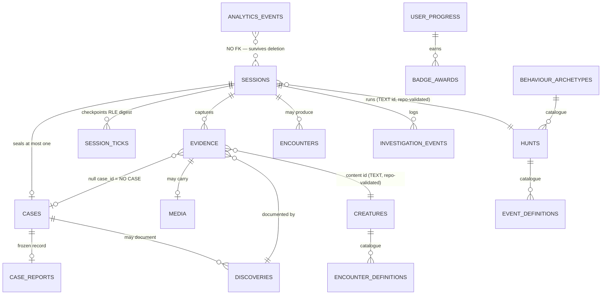

# Architecture Spine — NightTrace

## Design Paradigm

**Functional core / imperative shell.** One pure function decides everything; one imperative adapter does everything else.

The **core** is `src/engine/**` — a pure TypeScript function of `(seed, tick input) → Emission[]`. It reads no clock, draws from no global random source, touches no I/O, imports no framework. The **shell** is everything around it: sensors produce a quantized `SensorDigest`, the services layer owns time/persistence/OS, and exactly one presenter maps emissions to haptics, audio, stores and UI.

This is the load-bearing decision: it is what makes the simulation testable in a plain `node` Jest project, what makes a completed session reconstructible from a seed, and what lets a content drop add a phenomenon without an engine diff.

| Layer | Directory | May import |
| --- | --- | --- |
| Core (pure) | `src/engine/**` | `engine/**` and pure TS only — no `react`, `react-native`, `expo*`, `zustand` |
| Input adaptation | `src/sensors/**` | native sensor APIs, `engine/models` |
| Content | `src/data/**`, `src/db/**` | zod, `engine/models` |
| Shell | `src/services/**`, `src/features/**`, `src/ui/**`, `src/app/**` | everything |

## Invariants & Rules

```mermaid
graph TD
  app["app/ — routes only<br/>no SQL, no engine calls"] --> features
  features["features/ — smart components"] --> services
  features --> ui["ui/ — design primitives<br/>no business logic"]
  features --> store["store/ — zustand"]
  services["services/ — I/O, time, persistence"] --> engine
  services --> db["db/ — repositories"]
  services --> sensors["sensors/"]
  store --> engine
  db --> models
  sensors --> models
  engine["engine/ — PURE<br/>no react · no expo · no clock · no rng"] --> models["engine/models"]
  data["data/ — content as JSON<br/>zod-validated"] --> models
  style engine fill:#0B140E,stroke:#A3FF2B,stroke-width:2px
```



**Dependency direction is a rule, not a convention.** Arrows point only downward in that graph. `engine/` sits at the bottom: nothing from the shell may be reached from it, directly or transitively.

### AD-1 — The engine is a pure function; the shell owns all I/O

- **Binds:** `src/engine/**`, `all`
- **Prevents:** a second place that decides simulation; an engine that cannot be replayed because a run read a wall clock or a global random source; a sim that only runs inside React Native.
- **Rule:** `engine/**` may import only `engine/**` and dependency-free TS. It may not import `react`, `react-native`, `expo*`, or `zustand`; may not call `Date.now()`, `Math.random()`, or `performance.now()`; and performs no filesystem, network, database, audio, or haptics access. The host supplies elapsed time and user actions, each carrying its own timestamp. Enforced by ESLint `no-restricted-imports` and `no-restricted-globals`, not by discipline.

### AD-2 — Emissions are the engine's only output, and exactly one presenter consumes them

- **Binds:** `src/engine/**`, `src/features/**`, `src/audio/**`, `src/haptics/**`, `src/store/**`, `src/services/EvidenceService.ts`
- **Prevents:** two tools rendering the same engine event differently; a tool that reaches into engine state to "fix" a value; the engine learning about haptics, audio, or a store; two places deciding whether a capture is eligible.
- **Rule:** the engine returns `Emission[]` and mutates nothing. An `Emission` carries the full evidence payload it will commit — `kind`, certainty band, channel, tool, phase, and source. Exactly one node — `useSessionPresenter` — maps emissions to haptics, audio, store writes, evidence commits, and UI. Every tool surface converges on that node. **A capture is committed by the presenter and by nothing else.** Any code outside the presenter that reads an `Emission` is a defect.

### AD-3 — Determinism has a stated shape: seed + location + version + tick digest

- **Binds:** `src/engine/**`, `src/db/**`, `src/services/SeedService.ts`, tests
- **Prevents:** two builders disagreeing about what "reproducible" means; a schema with no room for the digest, making replay impossible after the fact.
- **Rule:** a completed session is reconstructible from `seed + hunt_id + content_version + tick_digest[]`. `SeedParts` is persisted **verbatim** on the session row and never recomputed. The digest is stored run-length-encoded. The engine never claims to reproduce "your night" and offers no user-facing replay; replay is an audit property. A `ContentVersion` bump deliberately breaks replay parity across a content drop — this is the only such break and it is intentional.

### AD-4 — Randomness is drawn only from labelled substreams

- **Binds:** `src/engine/RandomEngine.ts`, all engine modules, `src/data/**`
- **Prevents:** draw-order coupling — two features sharing one PRNG stream, so that adding a draw in one silently shifts every value the other produces.
- **Rule:** the engine's only randomness is `RandomEngine.fork(label)`. The seven labels — `rng.session`, `rng.events`, `rng.radar`, `rng.words`, `rng.encounters`, `rng.report`, `rng.signals` — are the closed set **of purposes for v1**: a new feature takes a new label from this set, never a draw from an existing one. Content-driven behaviour is the one expansion that needs no engine edit: an archetype or event table draws from the derived label `fork('rng.content.' + definitionId)`, one substream per definition, never a shared stream. **A fork label is part of the replay key (AD-3): it is never renamed once a content version has shipped.** The PRNG is our own xmur3 → sfc32 implementation — no `seedrandom`, no `pure-rand`, no dependency.

### AD-5 — Silence is an authored weight, never an absence

- **Binds:** `src/engine/rules/silence.ts`, `src/data/events/**`, FR-2, FR-35
- **Prevents:** an event table that can only select events — a metronome with extra steps.
- **Rule:** every event table's `emptyWeight` is strictly greater than zero, so a tick can always resolve to nothing. Asserted by test over the content set. Silence is content: authored, tunable, and checkable against AD-6's tuning targets.

### AD-6 — A directive may constrain the space of events; it may never name one

- **Binds:** `src/engine/directives/**`, `src/data/**`, FR-2
- **Prevents:** the direction layer dictating a moment, which is the engine's job; a directive that cannot be tested against the uncertainty rule.
- **Rule:** a `SessionDirective` narrows what *can* happen and never specifies what *does*. Directives surface to the user as verbs with no object. At most six per session, spaced at least three minutes apart, drawn from an authored pool, scheduled — never on demand, and with no "give me another" control. The **First-Run Directive** is the one bounded departure from engine honesty and is itself invisible: for a user with zero sealed cases the session's emission budget is forced to at least one, at least five minutes of silence elapse before it, and the first evidence emission is guaranteed capture-eligible. It does not apply once one Case is sealed. **No copy, indicator, or behaviour may reveal that it happened.**

### AD-7 — Archetypes emit effect values; the engine sees only the registry; content expands without an engine diff

- **Binds:** `src/engine/archetypes/**`, `src/data/archetypes/**`, FR-6, FR-7, FR-39
- **Prevents:** adding a phenomenon becoming an engineering task; two archetypes mutating shared state; a phenomenon name leaking into the engine and coupling it to content.
- **Rule:** archetypes return `ArchetypeEffect` values and never touch state. The engine imports `archetypes/registry.ts` and never an individual archetype file. **No file under `src/engine/` contains a phenomenon name.** Adding a phenomenon is one content definition, its assets, a registry entry, and a content-version bump. Asserted by test.

### AD-8 — Case status is a pure function that honours the encounter requirement and reads the slot count from the case

- **Binds:** `src/engine/rules/`, `src/services/CaseReportService.ts`, FR-19, FR-20, FR-21
- **Prevents:** the spendable-uncertainty-meter defect — a status function that lets a user grind toward `UNEXPLAINED` by tapping verdicts, or that teaches the triage asymmetry by experiment. It has already been built wrong once (the design prototype's `statusOf()`), which is why it is a rule and not a note.
- **Rule:** status is derived from evidence convergence, the presence of at least one Encounter, and the explained ratio — with `UNEXPLAINED` requiring **all three** of convergence ≥ 0.60, ≥ 1 Encounter, and explained ratio < 0.34, and `EXPLAINED` requiring explained ratio ≥ 0.60; anything else is `INCONCLUSIVE`. The signature slot count is read from the case (7–9), never from a constant. **Triage verdicts never move the signature strip** — convergence derives from Evidence alone. No copy, tooltip, or rendered affordance may state or imply what combination unlocks what.

### AD-9 — Two table families with opposite lifecycles, and foreign keys that never cross between them

- **Binds:** `src/db/**`, `src/data/**`, FR-7
- **Prevents:** a content rebuild cascade-deleting a user's evidence; content and user data being modelled as one family.
- **Rule:** *catalogue* tables (`creatures`, `hunts`, `event_definitions`, `encounter_definitions`, `behaviour_archetypes`, `badges`) are rebuilt from bundled JSON — delete, batch insert, one exclusive transaction — whenever the stored content version differs. `data/**` JSON is the **only** catalogue-provisioning path; there is no pre-baked database and no second seed mechanism. *User* tables are never touched by a rebuild. Foreign keys point **only within the user family**; `evidence.creature_id` and `sessions.hunt_id` are `TEXT` ids validated against the catalogue **in the repository layer**, never by a SQLite FK. Content is zod-validated at build and at boot, so malformed content fails the build rather than reaching a user.

### AD-10 — The persistence rule decides every storage question

- **Binds:** `src/db/**`, `src/services/**`, all features
- **Prevents:** two builders disagreeing about whether something gets a column; recomputable state drifting from the seed it was computed from; a sealed document silently mutating when content changes.
- **Rule:** **If a value can be recomputed from `(seed + content version + tick log)`, it must not be persisted. If the user would be angry to lose it, it must be in SQLite before the screen closes.** Live sensor values, tension, radar targets, the current event, and raw sample arrays are all recomputable and are never stored.
- **The one precedence.** These two clauses conflict for a sealed Case, and the spine settles it: **AD-10 governs live session state only. From the moment a Case is sealed, the values that constitute its report are persisted as the record and are never recomputed** — because AD-3 guarantees a content-version bump would change what recomputation yields, and FR-23 calls the report immutable. The same applies to Clearance and badge state at the moment the seal transaction commits (AD-24). Persisted-but-recomputable is the correct answer for a sealed Case Report and its sealed progression values, and for nothing else.

### AD-11 — A session is checkpointed and evidence is committed on find — never streamed

- **Binds:** `src/services/SessionService.ts`, `src/services/EvidenceService.ts`, `src/services/Clock.ts`, `src/db/**`, FR-18
- **Prevents:** losing a night's work to a dead battery or a crash; a per-tick write path that costs battery and WAL churn; two owners of the live clock.
- **Rule:** on session start, one `sessions` row (`status='active'`, seed, content version, hunt, start, conditions snapshot). Every **60 seconds** and on every backgrounding, one exclusive transaction updates elapsed time, appends the RLE tick digest, and inserts not-yet-committed evidence. **Evidence commits at the moment of capture**, not at session end. **`services/Clock` is the single producer of `SessionMs` inside a live session**; the store holds a render mirror only, and the 60-second checkpoint boundary is read from that same value. Finish is a single transaction that seals the report, discoveries, badges and progression. At critically low battery the app offers to seal immediately from the live session; it never seals automatically.

### AD-12 — SQL exists in exactly one layer, and routes own no data access

- **Binds:** `src/db/repositories/**`, `src/app/**`
- **Prevents:** SQL scattered across screens, so a schema change breaks an unknown number of call sites; a route that bypasses the repository's validation.
- **Rule:** `src/db/repositories/*` is the only place SQL string literals exist. Repositories return `engine/models` types via `src/db/mappers/*` (the only place `as` casts are admissible). Explicit column lists — no `SELECT *`. Prepared statements on hot paths. Routes contain no SQL and no engine calls; a screen composes components and calls a service.

### AD-13 — Sensors are isolated behind one hub, the engine sees only a digest, and a degraded channel still sustains the hunt

- **Binds:** `src/sensors/**`, `src/engine/**`, FR-5
- **Prevents:** a tool importing `expo-sensors` directly; a raw, high-rate, nondeterministic sensor value reaching the engine; a hunt becoming unshippable because a phone lacks a sensor.
- **Rule:** `src/sensors/` is the only module that imports `expo-sensors`, `expo-location`, or mic capture. The engine never sees a sensor — only a quantized `SensorDigest` produced at the tick rate. Every channel resolves to one of `ready` / `permission_not_requested` / `permission_denied` / `unavailable_hardware` / `unsupported_platform` / `error`. **No hunt depends on hardware**, and four contracts hold the equivalence, each asserting the *same timing, the same encounter, and the same evidence output* as the sensing path — camera denied renders the dark-room view; location denied runs the hunt uncharted (bearing only, no place seed); an absent magnetometer runs EMF on motion and clock. The fourth is the deliberate exception and is not a fallback: **with the microphone denied, EVP is removed from the tool carousel entirely.** Honest visible absence beats a degraded screen, and building a degraded EVP is a defect. Permissions are requested just in time by the tool that needs them, never at launch. The app is playable end to end with **zero permissions granted**. Android 12+ caps sensor delivery at 200 Hz by default; the digest does not need more, and the cap is a default a manifest permission lifts, not a physical ceiling.
- **Performance corollary:** a sensor-derived visual never causes a React re-render per sample. Sensor rates reach Reanimated `SharedValue`s and the digest; no per-sample value is written into React state.

### AD-14 — Model conventions are the type system's enforcement surface

- **Binds:** `src/engine/models/**`, `src/db/mappers/**`, FR-7
- **Prevents:** a hunt id passed where a creature id was expected — the bug class a content-driven system produces at scale, and the one unit tests catch last; a mutation that silently breaks replay.
- **Rule:** (1) every id is **branded** (`Brand<string, 'EvidenceId'>`) — no id is a bare `string`; (2) every field is `readonly`; (3) every variant set is a discriminated union tagged `kind`, and every consumer's `switch` is exhaustive with `default: never`, so adding an emission is a compile error until handled; (4) absence is spelled `null`, never `undefined` — a `null` is a claim, not an omission; (5) no `any`, no `as` outside mappers and validator output.

### AD-15 — No surface renders a number that could be read as a measurement

- **Binds:** `src/ui/**`, `src/features/**`, the Case Report, the Share Card, FR-15, FR-17, FR-22, FR-24, OQ-1
- **Prevents:** a percentage or a unit-bearing readout reaching any screen — the product's #1 risk. Unlike its category peers it survives the skeptic's first thirty seconds, and one readout in degrees or metres would spend that.
- **Rule:** readouts are qualitative bands and words only. There is no primitive that renders a percentage, an axis, a degree, a unit, a distance, or a signal strength. The only numerals that may appear are **counts of things that happened** and elapsed session time. `%` is banned in every shipped string (AD-16). A heading is a **compass word** — `N`, `NE` — never a bearing in degrees; proximity is a five-step band; the Sky surface aligns with a reticle and an eight-segment meter, never an azimuth/altitude pair. **This resolves FR-15's "compass heading" and FR-17's "azimuth and altitude readout" in favour of the form the UX spine already ships** — an FR consequence that required a unit is overridden, not carried.
- **Stat row.** The Case Report's stat row is `duration · evidence count · encounter count · source count` plus one `LOW`/`MODERATE`/`HIGH` activity band. The count of Sources counts **sensor channels** (AD-18), not emission origins.

### AD-16 — The claims boundary is enforced by a lint over an enumerated surface set — and the spine names what the lint cannot see

- **Binds:** all shipped strings, `assets/store/**`, FR-33, SM-8
- **Prevents:** a banned term reaching users; a passing build being mistaken for the product being honest.
- **Rule:** a build-failing lint checks the banned-term list over a **declared, enumerated string-surface set** — UI string tables, the iOS `Info.plist` purpose strings (highest-risk: they sit beside a field reading), the Android manifest permission strings, store title and description, screenshot captions, and the About notice. Approved market terms are the closed list in FR-33. The entertainment line is a **single exported constant** — `An investigation experience. Not a measurement.` — never a retyped literal, because the corpus already contains a wrong variant. It appears in three places by design: the first store-listing sentence, a non-skippable onboarding screen, and a permanent About notice reachable from Profile — and **any data export carries it too** (FR-27). The lint parses strings and **nothing else**: images, mechanics, juxtaposition, visual hierarchy, and the sum of individually-safe sentences are structurally out of its reach. Each of those five blind spots carries a release-review item (SM-8's second count, AD-30), not a lint rule.
- **Note — the disclaimer is not the defense.** Current App Store guideline 1.1.6 states that calling an app "for entertainment purposes" does **not** by itself excuse false information, and 2.3.1(a)/2.3.7 bar unverifiable claims in metadata. The product is protected by its **design**, not its disclaimer: readouts are qualitative bands (AD-15), no surface asserts a measurement, the fake-sensor risk is answered by never presenting a reading as real. A proposal that leans on the entertainment line to permit a measurement-shaped readout is therefore rejected, and the store-submission review must check metadata and screenshots against 2.3.1/2.3.7, not only against the banned-term list. The lint's list covers `%` and the measurement vocabulary; **it does not cover the Voice surface's own prohibition set** (`received`, `transmitted`, `heard`, `contacted`, `SENT`), which is a separate enumerated surface rule in AD-27.

### AD-17 — Theme tokens have two sources and a test that keeps them agreed

- **Binds:** `src/ui/theme/**`, `DESIGN.md`
- **Prevents:** the design spine and the shipped theme drifting apart — the class of defect the UX run already found three times in the reference prototype.
- **Rule:** `DESIGN.md`'s YAML frontmatter is the design source; `src/ui/theme/tokens.ts` is the code source; a CI test asserts the two agree on every token name and value. The test asserts the **token set's completeness** — there is **no light theme and there will not be one**, so a second palette appearing in either source fails it. Components read tokens from the theme module and never hard-code a raw value. **No information is conveyed by colour alone**, which is a rule the token sync cannot check and which therefore carries an accessibility review item (AD-28).

### AD-18 — Evidence kinds are two layers, and the whole Evidence shape is a closed vocabulary

- **Binds:** the evidence schema, `src/data/**`, the glyph set, the signature strip, the report ledger, the triage reason set, the `evidence_found` event, FR-18, OQ-11
- **Prevents:** content authoring, the glyph set, the triage reasons, and the analytics event each keying off a different count — the three-way disagreement between the source documents; the report's `SOURCES` count meaning two different things on two surfaces.
- **Rule:** the **persisted** vocabulary is a closed union of ten: `emf_swing`, `voice_capture`, `word_bank_hit`, `photo_anomaly`, `shadow_pass`, `footprint`, `tree_knock`, `sky_light`, `user_note`, `user_audio`. Per-hunt names in content are **aliases** that must resolve onto those ten. A content-validation test asserts every alias resolves and that no hunt introduces an eleventh kind. Each kind maps to exactly one glyph, and the glyph set is closed against the kind list by the same test.
- **The other four fields are closed too,** because AD-8 and FR-22 count them: `channel` is one of the six sensor channels; `tool` is one of the seven surface ids; `phase` is one of five (AD-25); and `source` is defined **once** as the producing **sensor channel** — identical in meaning to `channel`, and the field the report's `SOURCES` count counts. It is stored so the count is answerable without a join, not as a second concept.
- **The triage reason set** is closed in content and versioned with the alias list; the `evidence_found` event's props are typed so that `kind` and `channel` are drawn from these same unions and a missing field is a compile error.
- **Nothing logged is a record, not an error.** A log action with no reading commits an ordinary evidence row whose reading is `null`, and it counts toward the report's negative space. It is not an eleventh kind.

### AD-19 — The Daily Anomaly is copy and nothing else

- **Binds:** `src/data/**`, FR-30, FR-3, SM-C3, OQ-9
- **Prevents:** the engine making favourable draws on ordinary nights, which would falsify FR-3's claim to be the *single* deliberate departure from engine honesty and would require rewriting SM-C3.
- **Rule:** the Anomaly is one authored line drawn from a seeded set. It never produces a `SessionDirective` and never carries a guaranteed encounter. It is not shareable as a standalone image; if it ever is, it composes onto a Share Card so the entertainment line travels with it.

### AD-20 — Where the sources disagree, precedence is fixed

- **Binds:** all downstream conflict resolution, PRD §10, OQ-16
- **Prevents:** PRD §10's six conflicts, and the next one, being re-litigated during epics.
- **Rule:** **`01` (product/GDD) wins on anything the user experiences; `02` (implementation contract) wins on anything the engine or storage does; where they conflict on a shared contract — session phases, evidence kinds, intensity — the value is a product decision and `01` wins.** The PRD has already picked these sides: five phases, four intensity levels, five clearance ranks. The spine has subsequently picked three more, recorded here so they are decisions and not contradictions: the Sky surface renders alignment as a reticle and meter rather than the azimuth/altitude readout FR-17 names (AD-15); the purchase seams are deleted outright rather than retained against a possible return (AD-21); and held evidence survives the deletion of its Case rather than cascading (AD-24).

### AD-21 — Instrumentation is local, PII-free, and wide enough to measure the product's own metrics

- **Binds:** `src/services/AnalyticsService.ts`, FR-22, FR-20, FR-2, SM-5/6/7, addendum §F
- **Prevents:** the PRD shipping success metrics it has no event to measure; a monetization seam surviving into a free product.
- **Rule:** analytics are on-device only, with no network egress and no third-party SDK — the product may say *nothing leaves this phone* and may not say *nothing is recorded*. No coordinates, no free text, no media; `installRef` is a random resettable UUID. `analytics_events.session_id` is deliberately **not** a foreign key, so analytics outlive case deletion. Props are typed so a missing field is a compile error. The event set is **extended beyond the five live core events** to whatever report-view, triage-engagement, and phase-reach events SM-5, SM-6 and SM-7 require.
- **The one instruction this overrides.** Addendum §F.1 keeps a `paywall_viewed` event "so the schema does not need a migration when monetization returns." **This spine deletes it, and the `paywall_tier` column and the hunt gate with it.** There are **no purchase seams**: no purchase event, no tier column, no gate. The addendum's reason was migration cost; the PRD's own §5 says nothing in v1 may present or hint at a purchase, and a seam that exists is a seam that can be wired. Reinstating monetization is a migration — accepted deliberately.

### AD-22 — A shipped migration is immutable

- **Binds:** `src/db/migrations/**`
- **Prevents:** a silent schema fork between new installs and devices that already ran the old version.
- **Rule:** never edit a migration that has shipped — a device that ran it will not re-run it. Every migration runs inside a transaction. Additive-only for a shipped schema version; a destructive change requires a backup and a restore path. `migrate()` is idempotent, asserted by test.

### AD-23 — Build chain: CNG-generated native projects, built locally, submitted by fastlane

- **Binds:** the operational envelope — `app.config.ts`, CI, signing, both stores
- **Prevents:** an EAS dependency becoming load-bearing for a product with no backend; hand-edited native projects diverging from config; a build path that only exists in Expo Go.
- **Rule:** native projects are generated by CNG from `app.config.ts` and are **gitignored** — `app.config.ts` is the only source of native config truth. Builds run locally (`expo prebuild` → Xcode archive / `./gradlew bundleRelease`) and **fastlane owns signing and store submission for both platforms**. EAS is not in the path. Expo Go is not a delivery target: the camera's permission strings and manifest options are config-plugin values baked into the binary — and AD-16 makes the iOS purpose strings load-bearing — so `expo-dev-client` with a dev/preview/production profile set is mandatory.
- **Corollary — fastlane config never lives inside `ios/` or `android/`.** CNG regenerates those directories and `expo prebuild --clean` deletes them, so anything committed there is destroyed on the next prebuild. `fastlane/` sits at the repo root (as the tree shows) and reaches into the generated projects. Store floors tracked with this rule: Apple requires an **iOS 26 SDK build since 2026-04-28**; Google Play requires **target API 36** — which is why the stack pins compile/target 36. iOS distribution signs through the **WWDR** intermediate; the Developer ID Sub-CA notices concern Mac distribution outside the App Store and do not touch this product.

### AD-24 — A Case is an entity, a Session has a lifecycle, and the seal transaction owns the writing

- **Binds:** the user table family, `src/services/SessionService.ts`, `src/services/CaseReportService.ts`, `src/services/ProgressionService.ts`, `src/db/repositories/**`, FR-23, FR-25, FR-27, FR-28, FR-30
- **Prevents:** two schemas that cannot be reconciled — one where a Case *is* the report row and one where it has its own table — which AD-22 would then make permanent; a Journal that cannot show an unsealed case, an evidence row that cannot outlive its case, and a Clearance rank that changes retroactively.
- **Rule:** **`cases` is its own user table**, not the report row: a Session *seals at most one* Case, and a Case *has at most one* frozen Case Report (AD-10). Evidence carries a nullable `case_id`; `evidence.session_id` is always set, because evidence commits at capture (AD-11) — before any Case exists.
- **`sessions.status` ∈ `{active, sealed, discarded}`,** with exactly these transitions and owners. `active` is written by `SessionService` on start. `active → sealed` is written by the seal transaction: **one transaction, the sole writer of the Case, the Case Report, `discoveries`, `badge_awards`, and `user_progress`.** `ProgressionService` computes the inputs before the transaction opens; it never writes afterward, because a rank recomputed at render time would move when an unrelated Case is deleted. `active → discarded` is written when a Session ends under sixty seconds: **no report is produced, and the Case is not created** — evidence already committed at capture stays, unlinked (`NO CASE`).
- **Deleting a Case never deletes its Evidence.** The rows unlink — `case_id` becomes `null` — and keep rendering with a `NO CASE` chip. A user's history of having found something survives the deletion of the container that described it. The same holds for a discarded under-60-second Session, and analytics survive both (AD-21).
- **Resume.** PRD §6.2 says nothing resumes a Session mid-stream, and FR-30 asks Home to offer a resume affordance for an interrupted Session. **§6.2 wins on the engine and FR-30 wins on the affordance**: foregrounding an `active` row never replays the digest and never continues the simulation. It **seals from the last checkpoint** on the user's confirmation, which is the same path as the low-battery offer.
- **Sealing is irreversible, and a later edit is visible.** A sealed Case Report is immutable; the only way it changes is an explicit revision, which persists a `REVISED` mark on the Case permanently. The seal itself is gated on AD-29's hold.

### AD-25 — Three closed taxonomies: phases, no-event outcomes, and failure states

- **Binds:** `src/engine/**`, `src/engine/rules/**`, the report renderer, the session rail, FR-4, FR-21, FR-35, FR-36
- **Prevents:** a tool or an epic inventing a state the engine never emits; a report renderer that cannot key off a terminal outcome; the phase count drifting, which corrupts the RLE replay digest (AD-3).
- **Rule:** the engine's **phase ladder is closed at five** — `QUIET` → `SIGNALS` → `ACTIVITY` → `ENCOUNTER_WINDOW` → `RESOLUTION` — followed by a terminal `ENDED` marker that is *not* a phase and is not counted in the digest. The user-visible state is a separate four-word ladder — `QUIET` → `LISTENING` → `ACTIVE` → `CONTACT` — rendered as a hairline. **The user is never told what either means** (AD-20, AD-27).
- **A Session that finds nothing still ends in one of four named outcomes,** and the distinction between a night-attributed and a user-attributed result survives into the copy: `QUIET_NIGHT` and `WINDOW_CLOSED_EMPTY` are night-attributed; `FALSE_POSITIVE` and `NOT_FRAMED` are user-attributed. Each has its own rail line and its own report treatment.
- **A failed encounter still produces a complete report.** The six failure states are `NOTICED`, `CORNERED`, `GONE`, `MISDIRECTED`, `INTERFERENCE`, `NOT_ALIGNED`, and all six are first-class terminal evidence rather than aborted sessions. **`MISDIRECTED` carries a prohibition:** there is no in-session signal that it happened, and that is the design — no warning, no copy, no tell may be added. Discovering it after the fact is the mechanic.
- **Absence is meaningful only where a measurement was possible.** The report's `NOT RECORDED` block lists only what it was meaningful to have caught: a tool that was never opened, a permission that was denied, or a sensor that was absent generates no line, and the block is omitted entirely when no line qualifies.

### AD-26 — Three hidden scalars drive the simulation and none of them is ever observable

- **Binds:** `src/engine/TensionEngine.ts`, `src/engine/rules/attunement.ts`, `src/engine/**`, all surfaces
- **Prevents:** the engine's internal state becoming a readout — which would hand the user a dial to steer what they find, and would leak a tell through assistive technology even when nothing is drawn on screen.
- **Rule:** **Tension** (the `0..100` scalar driving phase transitions and rarity eligibility), **Attunement** (the `clamp01` scalar that rises on movement, tool use, and questions asked, gating `QUIET`→`SIGNALS` and `SIGNALS`→`ACTIVITY`), and the **rarity band** (the gated ceiling climbed by phase × tension × budget-consumed, never drawn from a table) are all hidden. Tension influences Encounter probability and **never guarantees an Encounter**. None of the three — nor `Seed` — is ever displayed, announced, or exposed to assistive technology (AD-28).

### AD-27 — A truthful mechanic is never described in copy that overstates it

- **Binds:** all surfaces, all shipped strings, the signature component, the Share Card, the Journal, `features/{voice,evp,tracker,report,journal}`
- **Prevents:** the third prohibition class — not a banned word (AD-16) and not a measurement-shaped number (AD-15), but **a sentence that misdescribes what the app actually did**. It is the class a lint over strings cannot see and a reviewer reading one screen at a time will not catch.
- **Rule:** the following are invariants, and each is a bug if violated:
  - **Voice / EVP.** No wording on these surfaces, or in their copy, **states or implies that anything was received, transmitted, heard, or contacted.** No release stamps `SENT` or any word implying a message left the device. The permanent surface disclaimer `Bands are theatre. Nothing here is received.` is part of the surface, not a tip.
  - **Voice timing.** The surface says nothing for **at least twelve seconds**; a response may arrive up to ninety seconds later **and may arrive on a different tool than the one that asked.** Both are load-bearing — they are what makes the Mimic's verb and its `MISDIRECTED` state possible — and both are engine-and-presenter timing rules, not copy.
  - **Observer inversion.** **The app never tells the user any of this.** No tutorial, hint, tooltip, or line of copy connects stillness to safety or explains the inversion. The non-instruction is the requirement.
  - **Signature archive.** The `?` tile is never labelled, captioned, pointed at, or the target of a coach mark, and **no surface states or implies that a full match is reachable**, that one exists, or what completing a slot would identify. There is no progress readout toward a match, no completion count, no per-Phenomenon checklist.
  - **Journal.** No locked entries, no silhouettes, no unlock requirements — every Hunt is selectable from first launch.
  - **Share Card.** No watermark, no URL, no QR code, no app-store badge, no "made with" line, no attribution of any kind. The field note is drawn from authored options or written by the user; **the app never generates it.** Re-rendering the same Case produces a perceptually identical image.
  - **Tracker.** Proximity is inferred from the user's own movement, and **the surface itself carries that disclosure** — long-pressing the ladder is its natural home. It is never buried in settings.
  - **Contested evidence.** Some evidence is internally planted so the user can catch and discard it. It **presents identically to ordinary evidence until triaged**; nothing in the interface says an item is contested, and nothing congratulates the user afterwards. It never resolves to `UNEXPLAINED` on its own and never fabricates an Encounter.
  - **Camera.** Pinch-to-zoom is deliberately not implemented — zoom invites "let me look closer," and looking closer is what an Encounter must resist. The capture must read as a glimpse, not footage.
  - **Camera and audio mode.** Glitch is the only channel through which night-vision styling, scan lines, heavy noise, and chromatic aberration ever appear, and only at `Intense` and `Ritual`.

### AD-28 — The accessibility floor is a cross-cutting contract, and the hidden stays hidden

- **Binds:** `src/ui/**`, `src/features/report/**`, `src/features/journal/**`, all live surfaces, PRD §6.1, addendum §H
- **Prevents:** the sighted half of the honesty rule shipping without its assistive-technology half; four surfaces each implementing Reduce Motion differently; a screen reader announcing a scalar no sighted user can see.
- **Rule:** the Case Report and Field Journal are fully navigable with VoiceOver and TalkBack. **Live regions announce evidence capture and phase change only** — nothing else, because an over-eager live region interrupts mid-flow. **Hidden internal values are never announced** — Tension, Attunement, rarity, and Seed never reach assistive technology (AD-26); announcing a scalar the sighted user cannot see is a tell as well as a defect.
- **Dynamic Type** is supported to 200%, with the intensity rail and the tool row capped at 140%. At the largest sizes the body clamps and scrolls and primary buttons never leave the screen. The tool row needs a different **form factor** at large sizes, not a smaller target; the two-row labelled grid is the direction, and it is open (Deferred).
- **Reduce Motion** replaces transitions with cross-fades, makes the sweep static, animates radar dots statically at 0.5 Hz, and **disables the glitch channel and re-routes it to audio.**
- **Contrast** is a floor on the token set (AD-17), not a per-screen choice. **Orientation** is portrait-locked except the Camera and Sky surfaces. No interactive target is below 44pt. iPad is not a target.

### AD-29 — The field is a place: it starts and stops as one, and certain acts are hold-gated

- **Binds:** `src/app/**` (the route tree), `src/features/session/**`, `src/services/SessionService.ts`, FR-10, FR-23, FR-25, FR-30
- **Prevents:** a back gesture or a notification quietly ending a night; two epics building different route trees for the same IA; a mistimed tap filing a Case; a session that advances while the phone is in a pocket.
- **Rule:** **Backgrounding is a hard stop.** On background — an incoming call included — all channels go off, the camera goes inactive, the engine pauses, and **elapsed time freezes**; a session does not advance while the phone is in a pocket. On foreground there is a two-second re-calibration grace period with no events. An encounter that would fire while backgrounded is **suppressed entirely and does not count against the session's encounter allowance.** AD-3's determinism depends on this, and AD-11's checkpoint is its write.
- **Hold, not tap, for anything irreversible or initiating.** `HOLD TO ENTER THE FIELD` is 800 ms; `SEAL & FILE` is 600 ms. The safelight fill is the only progress indicator in the product, and it indicates a gesture, never a quantity.
- **The route tree is the IA, and it has exactly four tabs.** `HOME · INVESTIGATE · FIELD JOURNAL · PROFILE` — four, and no Equipment tab (tools live inside a live Session) and no Settings tab (settings live inside Profile). The full tree is in the Structural Seed; the tab bar is **hidden entirely during Brief and Session**; tools push **above** the session, full-screen, one at a time, and the camera preview unmounts on pop; the Case Report is a **destination, not a modal**; sheets are never stacked two deep except Triage over a Session.
- **Five navigation invariants, each a bug if violated:** (1) a live session is never more than one gesture from its tools; (2) **no path ends a session without offering `SEAL & FILE`** — a back gesture raises the *Leave the field* sheet, never a silent discard; (3) the report is always reachable from the Journal and at the end of a session; (4) no dead ends — every empty state carries exactly one action; (5) **intensity is locked during a case** and cannot be changed mid-investigation.

### AD-30 — The operational envelope: what runs the gates, what may never phone home, and how a build ships

- **Binds:** CI, `fastlane/`, `services/Logger.ts`, release process, AD-16's review items
- **Prevents:** the spine naming a gate as "CI-blocking" when no CI exists; a crash reporter silently violating the no-egress promise; signing material committed to the repo; a bad build with no way back.
- **Rule:** a **CI pipeline exists and is the enforcement locus** for the gates this spine names — both Jest projects, the ESLint boundary rules, the token-sync test (AD-17), the content-validation and alias tests (AD-9, AD-18), migration idempotency (AD-22), and the golden-seed replay (AD-3). A rule that names a gate and no pipeline is unenforceable. The provider is open (Deferred); the pipeline is not.
- **Crash reporting is local.** AD-21's no-egress rule makes a hosted crash reporter a violation. The crash story is `services/Logger.ts` plus AD-11's checkpoint: an interrupted session is recoverable from `sessions` and its RLE digest, and **that recovery is the crash-recovery story** (AD-24). No third-party SDK, no upload, no identifier.
- **Signing material never enters the repository.** Certificates, provisioning profiles, keystores, and fastlane credentials live outside the tree and outside the generated `ios/` and `android/` directories; the repo carries configuration, never a secret.
- **Release is manual and reversible.** fastlane owns version and build-number stamping across both platforms; the review item AD-16 and SM-8 both depend on is a **release checklist owned by a named person**, not an intention. Rollout strategy and a withdrawal path are decided at first submission (Deferred).

## Consistency Conventions

| Concern | Convention |
| --- | --- |
| Naming — files | `PascalCase.ts` for a module with one export (a service, a repository, an engine stage); `camelCase.ts` for a barrel or a helper; `kebab-case.tsx` for a route file (house convention, not an Expo Router requirement) |
| Naming — entities | PRD §3 Glossary is normative. A synonym is a defect: `Emission` not "event"; `Case` not "session"; `Tool surface` not "tool"; `Encounter` not "sighting". Glossary terms are used verbatim in types, columns, and events |
| Naming — DB | `snake_case` tables and columns; ids are `<entity>_id`; a row's shape is mapped to a camelCase model in `db/mappers/*` and never leaves the repository unmapped |
| Ids | Branded TS types at compile time; opaque strings at runtime. `IdFactory` is the only producer. Content ids are `kebab-case` slugs |
| Dates & time | The engine speaks only `SessionMs` (elapsed) and `TickIndex`. `services/Clock` is the single producer of both `SessionMs` in a live session and of `EpochMs`. No wall clock anywhere in `engine/` |
| Error shape | `Result<T, E>` from `util/result.ts` for recoverable paths; `invariant()` for programmer error. No throwing across a service boundary for an expected condition |
| State mutation | Only `services/*` and `store/*` mutate. The engine is `(state, digest) → (state, Emission[])`: it returns new state and never mutates the one it was given. Components never write to a store slice another component owns |
| Config | Settings live in `expo-sqlite/kv-store` behind the typed `db/kv.ts` wrapper — a typo is a compile error. No settings table |
| Logging | `services/Logger.ts` only; no `console.*` in `src/` outside it. Logs never contain evidence content, coordinates, or free text |
| Media | Files on disk under `Paths.document/cases/<caseRef>/`; rows store `relative_path`, `mime`, `bytes`, `duration_ms`, `checksum`. **Never a BLOB.** Paths are always relative, so an app update cannot break them. **A marking that must travel with a capture — the Sky `GENERATED` label — is composed into the stored pixels at capture.** No surface re-derives it, and a display-time overlay does not satisfy the requirement |
| Privacy | No coordinates appear on any Case Report — location is a coarse bucket plus a human label. **Exactly two free-text columns exist in the entire schema.** The count is a privacy budget: a third is an explicit decision, not an accident |
| Testing | Two Jest projects: `engine` (node preset — possible only because of AD-1) and `ui` (jest-expo + testing-library). Plus golden-seed replay, migration idempotency, and zod content validation as CI tests (AD-30) |
| Quality gates | `tsconfig` strict + `noUncheckedIndexedAccess`, `exactOptionalPropertyTypes`, `noImplicitOverride`. ESLint boundary rules encode AD-1, AD-12, AD-13. All three are CI-blocking |

## Stack

*Seed — verified at authoring; the code owns this once it exists. Rationale in the memlog and addendum §G.0–G.1.*

| Name | Version |
| --- | --- |
| Expo SDK | **57.0.0** — `expo@57.0.26` (SDK 57 is stable; SDK 58 is beta only, do not adopt) |
| React Native / React | 0.86.3 / 19.2.3 |
| Node | ≥ 22.13 |
| iOS / Android floors | iOS 16.4+ (Xcode 26.4+) / Android 7+ (compile & target SDK 36) |
| Navigation | `expo-router` 57.0.24 (file-based, typed routes, `src/app`) |
| State | `zustand` 5.0.15 (sessionStore · sensorStore · settingsStore · uiStore) |
| Persistence | `expo-sqlite` (+ `expo-sqlite/kv-store` for scalar prefs) |
| Sensors | `expo-sensors` · `expo-location` |
| Camera / audio | `expo-camera` (`CameraView`) · `expo-audio` (`useAudioStream` PCM) |
| Files / sharing / media | `expo-file-system` (`File`/`Directory`/`Paths`) · `expo-sharing` · `expo-media-library` (`Asset.create`) |
| Device | `expo-haptics` · `expo-keep-awake` · `expo-brightness` |
| Animation | Reanimated 4.5.1 · worklets 0.10.1 · gesture-handler 2.32.0 |
| Share-card raster | `react-native-view-shot` 5.1.0 (SDK-57 pinned) |
| Content validation | `zod` 4.6.5 |
| Long lists | `@shopify/flash-list` 2.0.2 (SDK-57 pinned — let `expo install` choose; npm latest is 2.3.3) |
| Testing | `jest-expo` 57.0.5 · `@testing-library/react-native` 14.0.1 |
| Fonts | Serif for anything a person would write; mono for anything the machine records — `Newsreader` (OFL-1.1, `@expo-google-fonts/newsreader`) + a mono, subset Latin-1 (see Open) |

## Structural Seed

```text
nighttrace/
├── app.config.ts        # the ONLY source of native config truth; CNG generates from it
├── fastlane/            # Fastfile + Appfile per platform; signing + store submission
├── metro.config.js      # only if a non-default resolver is needed; Expo already covers .db assets
├── eslint.config.js     # boundary rules: engine purity, sensor isolation, no-SQL-outside-db
├── jest.config.js       # projects: engine (node) + ui (jest-expo)
├── assets/
│   ├── audio/{ambience,stings,wordbank,vocals,ui}/
│   ├── sprites/{ghost,bigfoot,shadow,ufo}/    # transparent, low-alpha, never centered
│   ├── images/{overlays,share-card,onboarding,textures}/
│   └── store/                                 # listing copy + screenshots; inside AD-16's lint set
└── src/
    ├── app/             # Expo Router: the IA, as typed routes
    │   ├── (onboarding)/        # 4 screens; screen 1 has no back
    │   ├── (tabs)/              # HOME · INVESTIGATE · FIELD JOURNAL · PROFILE — four, only four
    │   │   └── journal/         #   Overview · Phenomena · Evidence · Cases
    │   ├── hunt/[huntId]/brief  # tab bar hidden
    │   ├── session/             # immersive; tick host; tool row; tools push above
    │   ├── case/[caseId]/       # CASE REPORT (destination) · share/ · evidence/[evidenceId]
    │   ├── field-note/          # its own mode — not a case, no report
    │   └── (modals)/            # sheets: intensity · low power · permissions · triage · confirm ·
    │                            #   leave the field · low battery · directive · anomaly · clearance ·
    │                            #   delete my data · discard case · about
    ├── engine/          # PURE TS — the functional core
    │   ├── InvestigationEngine.ts · EventScheduler.ts · TensionEngine.ts
    │   ├── RadarSimulator.ts · EmfPipeline.ts · RandomEngine.ts
    │   ├── archetypes/{Observer,Stalker,Mimic,Ambusher}.ts + registry.ts
    │   ├── directives/ · sources/ · rules/
    │   ├── models/      # one file per aggregate
    │   └── __tests__/   # golden-seed replay
    ├── sensors/         # the ONLY importer of expo-sensors / expo-location / mic
    ├── audio/ · haptics/
    ├── data/            # content as data, zod-validated
    ├── db/              # client · migrations · mappers · repositories · kv
    ├── services/        # orchestration: Session · Evidence · CaseReport · ShareCard ·
    │                    # Progression · Seed · Permission · Analytics · Clock · IdFactory · Logger
    ├── store/           # zustand: session · sensor · settings · ui
    ├── features/        # smart components, one folder per surface
    └── ui/              # design primitives + theme (no business logic)
```

**Deployment & environments.** There is no backend, no server, and no network call — the operational envelope *is* the device. Three build profiles: **dev** (dev-client, engine debug overlay on), **preview** (internal distribution, both platforms), **production** (store-signed). Environments differ only in signing identity, bundle/package id suffix, and whether analytics debug assertions are active; there is no environment with a different runtime behaviour, because there is nothing to point at. The only external systems are Apple's and Google's stores, and the only runtime dependency on them is installation. Everything else — sensors, storage, audio, the simulation — is on the phone. What runs the gates is AD-30.

```mermaid
graph LR
  subgraph device["The phone — the entire runtime"]
    UI["UI · features/ · ui/"] --> PRES["useSessionPresenter<br/>the single emission consumer"]
    PRES --> AUD["audio/ · haptics/"]
    PRES --> ST["store/ (zustand)"]
    PRES --> EVID["services/EvidenceService<br/>the only committer"]
    ST --> ENG["engine/ — pure simulation"]
    SENS["sensors/ — expo-sensors · location · mic"] --> HUB["SensorHub → SensorDigest"]
    HUB --> ENG
    SVC["services/"] --> ENG
    SVC --> DB[("nighttrace.db<br/>SQLite + WAL")]
    SVC --> FS["Paths.document/cases/&lt;ref&gt;/<br/>media on disk"]
    SENS --> CAM["CameraView (one preview max)"]
  end
  BUILD["CNG + fastlane<br/>local build"] -.signed binary.-> STORE["App Store · Google Play"]
  STORE -.install only.-> device
  device -. "no network call, ever" .-> X["✕"]
  style ENG fill:#0B140E,stroke:#A3FF2B,stroke-width:2px
  style X fill:#0B140E,stroke:#5A6B58,stroke-dasharray: 4 4
```





**Two relations in that diagram are deliberate non-keys (AD-9, AD-21):** `SESSIONS → HUNTS`, `EVIDENCE → CREATURES`, and the `sessions.hunt_id` / `evidence.creature_id` columns are `TEXT` ids validated in the repository layer, so a content rebuild cannot cascade into a user's evidence; and `ANALYTICS_EVENTS → SESSIONS` is dotted because it is intentionally *not* a foreign key, so analytics outlive a Case deletion. The third asymmetry is AD-24's: `EVIDENCE → CASES` is optional, so deleting a Case unlinks evidence rather than erasing it.

## Capability → Architecture Map

| Capability / Area | Lives in | Governed by |
| --- | --- | --- |
| §4.1 Investigation Engine (FR-1…FR-5, FR-35, FR-36) | `engine/` + `services/SessionService` | AD-1, AD-2, AD-3, AD-4, AD-5, AD-6, AD-25 |
| §4.2 Four Phenomena (FR-6…FR-8, FR-37, FR-38, FR-39) | `engine/archetypes/` + `data/{creatures,hunts,archetypes}` | AD-7, AD-9, AD-20, AD-27 |
| §4.3 Hunt Brief & ritual (FR-9, FR-10) | `features/session/`, `app/hunt/[huntId]/brief` | AD-13, AD-14, AD-29 |
| §4.4 Tool set (FR-11…FR-17) | `features/{emf,radar,voice,evp,camera,tracker,sky}` + `sensors/` | AD-2, AD-13, AD-15, AD-27, AD-29 |
| §4.5 Evidence & triage (FR-18…FR-21, FR-34) | `engine/rules/evidence.ts` + `services/EvidenceService` | AD-8, AD-10, AD-11, AD-18, AD-27 |
| §4.6 Case Report (FR-22, FR-23) | `features/report/` + `services/CaseReportService` | AD-8, AD-10, AD-15, AD-16, AD-17, AD-24, AD-25 |
| §4.7 Share Card (FR-24) | `features/report/share` + `services/ShareCardService` | AD-15, AD-16, AD-17, AD-27 |
| §4.8 Field Journal (FR-25…FR-27) | `features/journal/` + `db/repositories/Journal*` | AD-9, AD-10, AD-12, AD-24, AD-27 |
| §4.9 Progression (FR-28, FR-29) | `services/ProgressionService` + `db/repositories/Progression*` | AD-10, AD-12, AD-24 |
| §4.10 Home & Daily Anomaly (FR-30) | `features/home/` + `data/` | AD-19, AD-24 |
| §4.11 Field Note (FR-31) | `features/session/` (own mode) | AD-10, AD-11 |
| §4.12 Onboarding & claims (FR-32, FR-33) | `app/(onboarding)/`, `app/(modals)/about` | AD-16, AD-27 |
| Cross-cutting: determinism & replay | `engine/RandomEngine`, `db` tick storage | AD-3, AD-4 |
| Cross-cutting: hidden scalars | `engine/TensionEngine`, `engine/rules/attunement` | AD-26 |
| Cross-cutting: persistence & media | `db/`, `Paths.document/cases/` | AD-9, AD-10, AD-11, AD-12, AD-22, AD-24 |
| Cross-cutting: accessibility | `ui/`, `features/report`, `features/journal` | AD-28 |
| Cross-cutting: privacy | the schema, the Case Report | AD-21, Media & Privacy conventions |
| Cross-cutting: analytics | `services/AnalyticsService` | AD-21 |
| Cross-cutting: build, CI & release | `app.config.ts`, `fastlane/`, CI | AD-23, AD-30 |

## Deferred

- **The final per-hunt evidence alias list and the triage reason set.** AD-18 fixes *the model* — a closed ten-kind engine vocabulary with content aliases. Deciding which alias each of the four hunts actually uses is content authoring, not architecture. Unblocks when OQ-11's content pass runs.
- **The CI provider and the release rollout path.** AD-30 fixes *that* a pipeline runs the named gates and *that* release is a manual, reversible, checklist-owned act. Which hosted runner, and whether rollout is staged, are operational choices with no architectural content.
- **Tuning values (addendum §C.6) and the test matrix.** Emission rates, silence bands, encounter-rate bands, and the 500-seed sweep are engine-implementation parameters, not invariants. The *shape* — the anti-metric on the inter-emission ratio, the golden-seed replay test — is fixed by AD-3 and AD-5.
- **The sampling ladder's exact rungs, and low-power as behaviour.** OQ-2 set the budget (≤ 4%/hour in low-power). The rungs themselves and the duty-cycle shapes are `sensors/dutyCycle` implementation; the behaviour the epic needs — that low power drops to the lowest rung and **disables ambience and the glitch channel** — is AD-28's Reduce Motion sibling and is fixed here, not deferred.
- **The tool row's large-type form factor.** The *cap* is AD-28's: **140%**, matching addendum §H and the UX spine, and it is not an answer. What the row becomes past the cap — the two-row labelled grid is the direction worth validating — is unresolved and belongs to UX, not to this spine. The reference prototype does not implement it.
- **The mono face and the serif/mono split's exact families.** `DESIGN.md` names `Newsreader` for prose and a mono for machine-recorded values; the mono family and the full subsetting strategy are a `ui/theme` decision. The load-bearing part — serif means written, mono means recorded — is not negotiable.
- **The safelight accent's hue.** `DESIGN.md`'s rationale argues for a deep red on dark-adaptation grounds while the implemented token is lime. The rationale is sound and the hue does not implement it. Recorded as an open question for the design owner; the token *name* is stable so code is unaffected either way.
- **Director Mode and the global shared-seed night.** Engine `sources/` reserves a `RemoteDirectorSource` seam and the store reserves a storage seam; no implementation ships in v1. This is a reserved *seam*, not a reserved *feature*: unlike AD-21's purchase seams — which are deleted because a seam can be wired to a surface — this one has no user-facing surface to reach it, and it is recorded here so it is not mistaken for either.
- **Localisation.** English-only in v1. The content model carries a single locale column; restructuring the word banks and narrative templates for translation is deferred together with OQ-7.
- **Clearance-gated cosmetic themes (FR-28).** AD-17 assumes exactly one theme. Whether Clearance unlocks a cosmetic variant, and how the token-sync test would then assert two sets, is unresolved.
- **Share Card variants, journal full-text search, hidden badges, iPad, biometrics.** All deferred by PRD §6.2; none affects an invariant above.
- **Build order.** Override 14 ratified Report-first (`Engine → Report → Journal`). This is sequencing material for epics, not an invariant this spine can hold.
- **OQ-4 and OQ-5.** Whether triage feels compulsory, and whether the opening needs one micro-directive, are playtest questions with no architectural content. Carried forward, owner = design, revisited at the first playable report.
